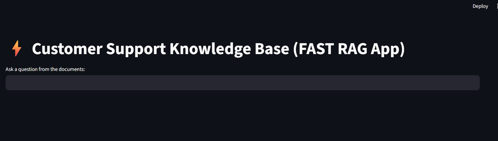
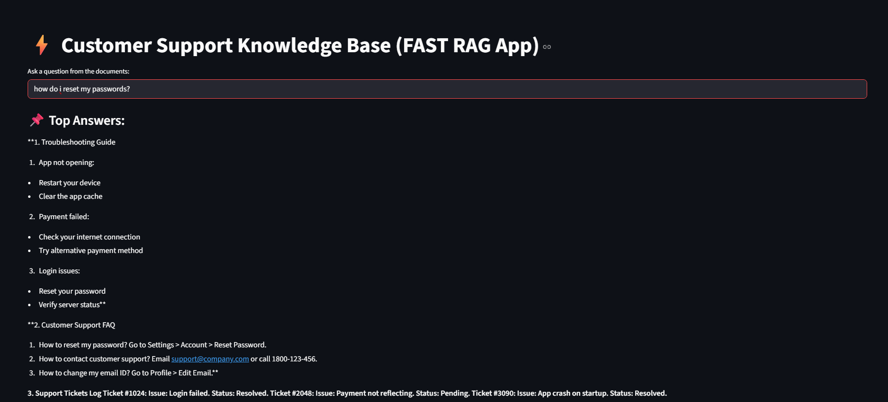

# 🚀 Customer Support Knowledge Base – FAST RAG App

A simple and fast **offline Retrieval-Augmented Generation (RAG)** application that lets users search answers from company documents such as:

- 📄 FAQs  
- 🛠 Troubleshooting Guides  
- 🎫 Support Ticket Logs  

All processing happens **offline** using a local embedding model and FAISS vector search.  
No API keys, no internet required.

---

## ⭐ Features

- ✔ Works 100% Offline  
- ✔ Local MiniLM Embeddings  
- ✔ FAISS Vector Database  
- ✔ PDF Knowledge Base  
- ✔ Fast & Accurate Search  
- ✔ Clean Streamlit UI  
- ✔ End-to-End RAG Pipeline  

---

## 📁 Project Structure

```
RAG-customer-support-knowledge-base/
│
├── app/
│   └── streamlit_app.py
│
├── data/
│   ├── Customer_FAQ.pdf
│   ├── Support_Tickets.pdf
│   └── Troubleshooting_Guide.pdf
│
├── images/
│   ├── ui.png
│   └── output.png
│
├── models/
│   └── vector_store/
│       ├── index.faiss
│       └── index.pkl
│
├── rag_pipeline.py
├── requirements.txt
└── README.md
```

---

## ⚙️ Tech Stack

- Python  
- Streamlit  
- Sentence Transformers (MiniLM)  
- FAISS  
- LangChain PDF Loader  

---

## 🔧 How to Run

### 1️⃣ Install Dependencies
```
pip install -r requirements.txt
```

### 2️⃣ Build Vector Database (Run Once)
```
python rag_pipeline.py
```

### 3️⃣ Start Streamlit App
```
streamlit run app/streamlit_app.py
```

Then open in browser:  
👉 http://localhost:8501

---

## 🧠 Example Queries

Try asking:

- "How do I reset my password?"  
- "App not opening — what to do?"  
- "How to contact customer support?"  
- "Login failed — troubleshooting steps?"  

---

## 📸 Screenshots

### 🖥️ App UI


### 🧠 Example Output


---

## 👨‍💻 Developer

**Srinivas – B.Tech CSE (AI & ML)**  
Built a complete offline RAG system with FAISS, MiniLM embeddings, and Streamlit.

---

⭐ *If you like this project, consider giving it a star on GitHub!*
